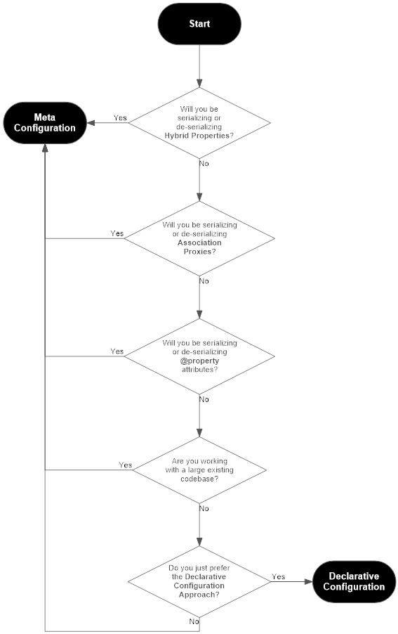

**********************************
Using SQLAthanor
**********************************

.. |strong| raw:: html

 <strong>

.. |/strong| raw:: html

 </strong>

.. contents::
  :local:
  :depth: 3
  :backlinks: entry

----------

.. _introduction:

Introduction
==========================================================

What is Serialization?
--------------------------

"Serialization" is a common short-hand for two important concepts:
:term:`serialization` and :term:`de-serialization`.

To over-simplify, **serialization** is the process of taking an object in one
programming language (say, Python) that can be understood by one program (say,
yours) and converting it into a format that can be understood by a different program,
often written in a different programming language (say, JavaScript).

**De-serialization** is the exact same process - but in reverse. It takes data in
another format, often from another program, and converts it into an object that
your program can understand.

So why is it important? Well, because modern programming is all about communication.
Which in this context means communication between different programs, APIs, microservices,
etc. And these various programs and microservices may be written in vastly different
programming languages, have (often different) approaches to security, etc. Which means
they need to be able to talk to each other appropriately.

Which is where serialization and de-serialization come in, since they're the process
that makes that communication possible.

In a very typical example, you can imagine a modern web application. The back-end
might be written in Python, maybe using a framework like
`Flask <http://flask.pocoo.org>`_ or `Django <https://www.djangoproject.com/>`_.
The back-end exposes a variety of RESTful APIs that handle the business logic of your
web app. But you've got an entirely separate front-end, probably written in
JavaScript using `React/Redux <https://github.com/reduxjs/react-redux>`_,
`AngularJS <https://angularjs.org/>`_, or something similar.

In most web applications, at some point your back-end will need to retrieve data
from a database (which an :term:`ORM <Object Relational Mapper (ORM)>` like
:doc:`SQLAlchemy <sqlalchemy:core/api_basics>` is great at), and will want to hand it off to
your front-end. A typical example might be if you want to list users, or in a social
media-style app, list a user's friends. So once your Python back-end has gotten a list
of users, how does it communicate that list to your JavaScript front-end? Most
likely by exchanging :term:`JSON <JavaScript Object Notation (JSON)>` objects.

Which means that your Python back-end needs to take the list of users it retrieved,
convert their data into JSON format, and transmit it to the front-end. That's
**serialization**.

But now let's say a user in your front-end changes their email address. The front-end
will need to let the back-end know, and your back-end will need to update the relevant
database record with the latest change. So how does the front-end communicate that
change to the back-end? Again, by sending a JSON object to the back-end. But your
back-end needs to parse that data, validate it, and then reflect the change in the
underlying database. The process of parsing that data? That's **de-serialization**.

Why **SQLAthanor**?
----------------------

So if serialziation and de-serialization are so important, how does this relate
to **SQLAthanor**? Well, serialization and de-serialization can be complicated:

* Different programs may need to serialize and de-serialize into and from multiple
  formats.
* Some data (like passwords) should only be **de**-serialized, but for security
  reasons should **never** be serialized.
* Serialization and de-serialization may need various pre-processing steps to
  validate the data or coerce it to/from different data types...and that
  validation/coercion logic may be different depending on the data format.
* The (fantastic) |strong| :doc:`SQLAlchemy ORM <sqlalchemy:orm/tutorial>` |/strong|
  handles database read/write operations amazingly, but does not include any
  serialization/de-serialization support.

This leads to a labor-intensive process of writing custom serialization/de-serialization
logic for multiple (different) models and repeating that process across multiple
applications. Better, we think, to package that functionality into a library.

Which is what **SQLAthanor** is.

It is designed to extend the functionality of the
:doc:`SQLAlchemy ORM <sqlalchemy:orm/tutorial>` with support for serialization
and de-serialization into/from:

* :term:`JSON <JavaScript Object Notation (JSON)>`
* :term:`CSV <Comma-Separated Value (CSV)>`
* :term:`YAML <YAML Ain't a Markup Language (YAML)>`
* Python :class:`dict <python:dict>`

Which should hopefully save some effort when building applications that need to
talk to the outside world (and really, don't all apps do these days?).

**SQLAthanor** vs. Alternatives
----------------------------------

.. include:: _versus_alternatives.rst

----------------

.. _features:

SQLAthanor Features
=======================

* Configure :term:`serialization` and :term:`de-serialization` support when
  defining your SQLAlchemy :term:`models <Model Class>`.
* Automatically include serialization methods in your SQLAlchemy
  :term:`model instances <model instance>`.
* Automatically include de-serialization "creator" methods in your SQLAlchemy
  :term:`models <model class>`.
* Automatically include de-serialization "updater" methods to your SQLAlchemy
  :term:`model instances <model instance>`.
* Support serialization and de-serialization across the most-common data exchange
  formats: :term:`JSON <JavaScript Object Notation (JSON)>`,
  :term:`CSV <Comma-Separated Value (CSV)>`,
  :term:`YAML <YAML Ain't a Markup Language (YAML)>`, and Python
  :class:`dict <python:dict>`.
* Support pre-processing before serialization/de-serialization for data validation
  or coercion.
* Support serialization and de-serialization for complex :term:`models <model class>`
  that may include: :term:`relationships <relationship>`,
  :term:`hybrid properties <hybrid property>`,
  :term:`association proxies <association proxy>`, or standard Python
  :class:`@property <python:property>`.
* Simultaneously support different configurations for different serialization or
  de-serialization requirements.
* Maintain all of the existing APIs, methods, functions, and functionality of
  :doc:`SQLAlchemy Core <sqlalchemy:core/api_basics>`.
* Maintain all of the existing APIs, methods, functions, and functionality of
  :doc:`SQLAlchemy ORM <sqlalchemy:orm/tutorial>`.
* Maintain all of the existing APIs, methods, functions, and functionality of
  :doc:`SQLAlchemy Declarative ORM <sqlalchemy:orm/extensions/declarative/index>`.

---------------

.. _overview:

Overview
==================================

**SQLAthanor** is designed to extend the fantastic
`SQLAlchemy`_ library, to provide it with seamless
:term:`serialization` and :term:`de-serialization` support. What do we mean by
seamless? Well, in an ideal world we want serialization and de-serialization to
work like this:

.. code-block:: python

  # To create serialized output from a model instance, just use:
  as_json = model_instance.to_json()
  as_csv = model_instance.to_csv()
  as_yaml = model_instance.to_yaml()
  as_dict = model_instance.to_dict()

  # To create a new model instance from serialized data, just use:
  new_as_instance = ModelClass.new_from_json(as_json)
  new_as_instance = ModelClass.new_from_csv(as_csv)
  new_as_instance = ModelClass.new_from_yaml(as_yaml)
  new_as_instance = ModelClass.new_from_dict(as_dict)

  # To update an existing model instance from serialized data, just use:
  model_instance.update_from_json(as_json)
  model_instance.update_from_csv(as_csv)
  model_instance.update_from_yaml(as_yaml)
  model_instance.update_from_dict(as_dict)

Even knowing nothing about `SQLAlchemy`_ or
**SQLAthanor**, it should be pretty easy to figure out what's happening in that
code, right?

Well, that's exactly what **SQLAthanor** does for you. So how? Let's break that down.

How SQLAthanor Works
-----------------------

**SQLAthanor** is a :term:`drop-in replacement` for `SQLAlchemy`_.

What does this mean? It means that it's designed to seamlessly replace *some* of
your SQLAlchemy ``import`` statements. Then, you can continue to define your
:term:`models <model class>` just as you would using the
:doc:`SQLAlchemy ORM <sqlalchemy:orm/tutorial>` - but now they'll support
:term:`serialization` and :term:`de-serialization`.

In other words, the process of using **SQLAthanor** is very simple:

#. Install **SQLAthanor**. (see :ref:`here <installation>`)
#. Import the components used to define your :term:`model classes <model class>`.
   (see :ref:`here <importing>`)
#. Define your :term:`model classes <model class>`, just as you would in
   `SQLAlchemy`_. (see :ref:`here <defining_models>`)
#. Configure which :term:`model attributes <model attribute>` to be
   serialized (output) and de-serialized (input). (see :ref:`here <configuration>`)
#. Configure any pre/post-processing for serialization and de-serialization,
   respectively. (see :ref:`here <extra_processing>`)
#. Serialize your :term:`model instances <model instance>` as needed. (see
   :ref:`here <serialization>`)
#. Create new :term:`model instances <model instance>` using de-serialization.
   (see :ref:`here <deserialization>`)
#. Update existing :term:`model instances <model instance>` using de-serialization.
   (see :ref:`here <deserialization>`)

And that's it! Once you've done the steps above, you can easily serialize data from
your models and de-serialize data into your models using simple methods.

.. tip::

  Because **SQLAthanor** inherits from and extends `SQLAlchemy`_,
  your existing SQLAlchemy :term:`models <model class>` will work with no change.

  By default, :term:`serialization` and :term:`de-serialization` are **disabled**
  for any :term:`model attribute` unless they are *explicitly* enabled.

--------------

.. _installation:

1. Installing SQLAthanor
============================

.. include:: _installation.rst

Dependencies
----------------

.. include:: _dependencies.rst

-------------

.. _importing:

2. Import SQLAthanor
=======================

.. include:: _import_sqlathanor.rst

---------------

.. _defining_models:

3. Define Your Models
=========================

.. tabs::

  .. tab:: Standard Approach

    Because **SQLAthanor** is a drop-in replacement for `SQLAlchemy`_ and its
    :doc:`Declarative ORM <sqlalchemy:orm/extensions/declarative/index>`, you can
    define your models the *exact same way* you would do so normally:

    .. seealso::

      * :doc:`SQLAlchemy Declarative ORM <sqlalchemy:orm/extensions/declarative/index>`
      * :doc:`SQLAlchemy ORM Tutorial <sqlalchemy:orm/tutorial>`
      * :doc:`Flask-SQLAlchemy: Declaring Models <flask_sqlalchemy:models>`

  .. tab:: Declarative Reflection

    `SQLAlchemy`_ supports the use of `reflection`_ with the
    :doc:`SQLAlchemy Declarative ORM <sqlalchemy:orm/extensions/declarative/index>`.

    This is a process where `SQLAlchemy`_ automatically constructs a
    :doc:`Declarative <sqlalchemy:orm/extensions/declarative/index>`
    :term:`model class` based on what it reads from the table definition stored in your
    SQL database *or* a corresponding :class:`Table <sqlalchemy:sqlalchemy.schema.Table>`
    instance already defined and registered with a
    :class:`MetaData <sqlalchemy:sqlalchemy.schema.MetaData>` object.

    **SQLAthanor** also supports the same pattern. For details, please see:
    :ref:`Using Declarative Reflection with SQLAthanor <using_reflection>`

    .. seealso::

      * :ref:`Using Declarative Reflection with SQLAthanor <using_reflection>`
      * **SQLAlchemy**: :doc:`Reflecting Database Objects <sqlalchemy:core/reflection>`
      * **SQLAlchemy**: `Using Reflection with Declarative <http://docs.sqlalchemy.org/en/latest/orm/extensions/declarative/table_config.html#using-reflection-with-declarative>`_

  .. tab:: Using Automap

    .. versionadded:: 0.2.0

    The :doc:`Automap Extension <sqlalchemy:orm/extensions/automap>` is an incredibly
    useful tool for modeling *existing* databases with minimal effort. What it does
    is it reasd your existing database's metadata and automatically constructs
    :doc:`SQLAlchemy Declarative ORM <sqlalchemy:orm/extensions/declarative/index>`
    :term:`model classes <model class>` populated with your tables' columns.

    Neat, right? Saves a ton of effort.

    Using **SQLAthanor** you can ensure that your automapped (automatically
    generated) models support serialization and de-serialization. For more
    details, please see: :ref:`Using Automap with SQLAthanor <using_automap>`.

    .. seealso::

      * :ref:`Using Automap with SQLAthanor <using_automap>`
      * **SQLAlchemy**: :doc:`Automap Extension <sqlalchemy:orm/extensions/automap>`

  .. tab:: Programmatically

    .. versionadded:: 0.3.0

    If you have serialized data in either :term:`CSV <Comma-Separated Value (CSV)>`,
    :term:`JSON <JavaScript Object Notation (JSON)>`,
    :term:`YAML <YAML Ain't a Markup Language (YAML)>`, or a Python
    :class:`dict <python:dict>`, you can programmatically generate a
    :doc:`SQLAlchemy Declarative <sqlalchemy:orm/extensions/declarative/index>`
    :term:`model class` using **SQLAthanor** with the syntax
    ``generate_model_from_<format>()`` where ``<format>`` corresponds to ``csv``,
    ``json``, ``yaml``, or ``dict``:

    .. code-block:: python

      ##### FROM CSV:
      from sqlathanor import generate_model_from_csv

      # Assuming that "csv_data" contains your CSV data
      CSVModel = generate_model_from_csv(csv_data,
                                         tablename = 'my_table_name',
                                         primary_key = 'id')

      ##### FROM JSON:
      from sqlathanor import generate_model_from_json

      # Assuming that "json_string" contains your JSON data in a string
      JSONModel = generate_model_from_json(json_string,
                                           tablename = 'my_table_name',
                                           primary_key = 'id')

      ##### FROM YAML:
      from sqlathanor import generate_model_from_yaml

      # Assuming that "yaml_string" contains your YAML data in a string
      YAMLModel = generate_model_from_yaml(yaml_string,
                                           tablename = 'my_table_name',
                                           primary_key = 'id')

      ##### FROM DICT:
      from sqlathanor import generate_model_from_dict

      # Assuming that "yaml_string" contains your YAML data in a string
      DictModel = generate_model_from_dict(dict_string,
                                           tablename = 'my_table_name',
                                           primary_key = 'id')

    .. seealso::

      * :func:`generate_model_from_csv() <sqlathanor.declarative.generate_model_from_csv>`
      * :func:`generate_model_from_json() <sqlathanor.declarative.generate_model_from_json>`
      * :func:`generate_model_from_yaml() <sqlathanor.declarative.generate_model_from_yaml>`
      * :func:`generate_model_from_dict() <sqlathanor.declarative.generate_model_from_dict>`

-----------------

.. _configuration:

4. Configure Serialization/De-serialization
==============================================

.. epigraph::

  explicit is better than implicit

  -- :PEP:`20` - The Zen of Python

By default (for security reasons) :term:`serialization` and :term:`de-serialization`
are *disabled* on all of your :term:`model attributes <model attribute>`. However,
**SQLAthanor** exists to let you *explicitly* enable :term:`serialization` and/or
:term:`de-serialization` for specific :term:`model attributes <model attribute>`.

Here are some important facts to understand for context:

  #. You can enable :term:`serialization` separately from :term:`de-serialization`.
     This allows you to do things like de-serialize a ``password`` field (expect it
     as an input), but never include it in the output that you serialize.
  #. You can configure :term:`serialization`/:term:`de-serialization` differently
     for different formats. **SQLAthanor** supports
     :term:`CSV <Comma-Separated Value (CSV)>`,
     :term:`JSON <JavaScript Object Notation (JSON)>`,
     :term:`YAML <YAML Ain't a Markup Language (YAML)>`, and Python
     :class:`dict <python:dict>`.
  #. You can serialize or de-serialize any :term:`model attribute` that is bound
     to your :term:`model class`. This includes:

     * Attributes that correspond to columns in the underlying SQL table.
     * Attributes that represent a :term:`relationship` to another
       :term:`model <model class>`.
     * Attributes that are defined as :term:`hybrid properties <hybrid property>`.
     * Attributes that are defined as :term:`association proxies <association proxy>`.
     * :term:`Instance attributes <instance attribute>` defined using Python's
       built-in :func:`@property <python:property>` decorator.

In general, **SQLAthanor** supports two different mechanisms to configure
serialization/de-serialization: :ref:`Declarative Configuration <declarative_configuration>`
and :ref:`Meta Configuration <meta_configuration>`.

.. _declarative_configuration:

Declarative Configuration
----------------------------

The :term:`Declarative Configuration` approach is modeled after the
:doc:`SQLAlchemy Declarative ORM <sqlalchemy:orm/extensions/declarative/index>`
itself. It allows you to configure a :term:`model attribute's <model attribute>`
:term:`serialization` and :term:`de-serialization` *when defining* the
:term:`model attribute`.

Here's a super-simplified example of how it works:

.. code-block:: python

  from sqlathanor import declarative_base, Column, relationship

  from sqlalchemy import Integer, String

  BaseModel = declarative_base()

  class User(BaseModel):
    __tablename__ = 'users'

    id = Column('id',
                Integer,
                primary_key = True,
                supports_csv = True,
                csv_sequence = 1,
                supports_json = True,
                supports_yaml = True,
                supports_dict = True,
                on_serialize = None,
                on_deserialize = None,
                display_name = None)

This example defines a :term:`model class` called ``User`` which corresponds
to a SQL database table named ``users``. The ``User`` class defines one
:term:`model attribute` named ``id`` (which corresponds to a
database :class:`Column <sqlathanor.schema.Column>` named ``id``). The database
column is an integer, and it operates as the primary key for the database table.

So far, this is all *exactly* like you would normally see in the
:doc:`SQLAlchemy Declarative ORM <sqlalchemy:orm/extensions/declarative/index>`.

But, there are some additional arguments supplied to
:class:`Column <sqlathanor.schema.Column>`: ``supports_csv``, ``csv_sequence``,
``supports_json``, ``supports_yaml``, ``supports_dict``, ``on_serialize``, and
``on_deserialize``. As you can probably guess, these arguments are what configure
:term:`serialization` and :term:`de-serialization` in **SQLAthanor** when using
:term:`declarative configuration`.

Here's what these arguments do:

.. _configuration_arguments:

.. function:: SQLAthanor Configuration Arguments

  :param supports_csv: Determines whether the column can be
    :term:`serialized <serialization>` to or :term:`de-serialized <de-serialization>`
    from :term:`CSV <Comma-Separated Value (CSV)>` format.

    If ``True``, can be serialized to CSV and de-serialized from CSV.
    If ``False``, will not be included when serialized to CSV and will be
    ignored if present in a de-serialized CSV.

    Can also accept a 2-member :class:`tuple <python:tuple>` (inbound / outbound)
    which determines de-serialization and serialization support respectively.

    Defaults to ``False``, which means the column will not be serialized to CSV
    or de-serialized from CSV.

  :type supports_csv: :class:`bool <python:bool>` or :class:`tuple <python:tuple>` of
    form (inbound: :class:`bool <python:bool>`, outbound: :class:`bool <python:bool>`)

  :param csv_sequence: Indicates the numbered position that the column should be in
    in a valid CSV-version of the object. Defaults to :obj:`None <python:None>`.

    .. note::

      If not specified, the column will go after any columns that *do* have a
      ``csv_sequence`` assigned, sorted alphabetically.

      If two columns have the same ``csv_sequence``, they will be sorted
      alphabetically.

  :type csv_sequence: :class:`int <python:int>` or :obj:`None <python:None>`

  :param supports_json: Determines whether the column can be
    :term:`serialized <serialization>` to or :term:`de-serialized <de-serialization>`
    from :term:`JSON <JavaScript Object Notation (JSON)>` format.

    If ``True``, can be serialized to JSON and de-serialized from JSON.
    If ``False``, will not be included when serialized to JSON and will be
    ignored if present in a de-serialized JSON.

    Can also accept a 2-member :class:`tuple <python:tuple>` (inbound / outbound)
    which determines de-serialization and serialization support respectively.

    Defaults to ``False``, which means the column will not be serialized to JSON
    or de-serialized from JSON.

  :type supports_json: :class:`bool <python:bool>` or :class:`tuple <python:tuple>` of
    form (inbound: :class:`bool <python:bool>`, outbound: :class:`bool <python:bool>`)

  :param supports_yaml: Determines whether the column can be
    :term:`serialized <serialization>` to or :term:`de-serialized <de-serialization>`
    from :term:`YAML <YAML Ain't a Markup Language (YAML)>` format.

    If ``True``, can be serialized to YAML and de-serialized from YAML.
    If ``False``, will not be included when serialized to YAML and will be
    ignored if present in a de-serialized YAML.

    Can also accept a 2-member :class:`tuple <python:tuple>` (inbound / outbound)
    which determines de-serialization and serialization support respectively.

    Defaults to ``False``, which means the column will not be serialized to YAML
    or de-serialized from YAML.

  :type supports_yaml: :class:`bool <python:bool>` or :class:`tuple <python:tuple>` of
    form (inbound: :class:`bool <python:bool>`, outbound: :class:`bool <python:bool>`)

  :param supports_dict: Determines whether the column can be
    :term:`serialized <serialization>` to or :term:`de-serialized <de-serialization>`
    from a Python :class:`dict <python:dict>`.

    If ``True``, can be serialized to :class:`dict <python:dict>` and
    de-serialized from a :class:`dict <python:dict>`. If ``False``, will not be
    included when serialized to :class:`dict <python:dict>` and will be
    ignored if present in a de-serialized :class:`dict <python:dict>`.

    Can also accept a 2-member :class:`tuple <python:tuple>` (inbound / outbound)
    which determines de-serialization and serialization support respectively.

    Defaults to ``False``, which means the column will not be serialized to a
    :class:`dict <python:dict>` or de-serialized from a :class:`dict <python:dict>`.

  :type supports_dict: :class:`bool <python:bool>` or :class:`tuple <python:tuple>` of
    form (inbound: :class:`bool <python:bool>`, outbound: :class:`bool <python:bool>`)

  :param on_deserialize: A function that will be called when attempting to
    assign a de-serialized value to the column. This is intended to either coerce
    the value being assigned to a form that is acceptable by the column, or
    raise an exception if it cannot be coerced. If :obj:`None <python:None>`, the data
    type's default ``on_deserialize`` function will be called instead.

    .. tip::

      If you need to execute different ``on_deserialize`` functions for
      different formats, you can also supply a :class:`dict <python:dict>`:

      .. code-block:: python

        on_deserialize = {
          'csv': csv_on_deserialize_callable,
          'json': json_on_deserialize_callable,
          'yaml': yaml_on_deserialize_callable,
          'dict': dict_on_deserialize_callable
        }

    Defaults to :obj:`None <python:None>`.

  :type on_deserialize: callable or :class:`dict <python:dict>` with formats
    as keys and values as callables

  :param on_serialize: A function that will be called when attempting to
    serialize a value from the column. If :obj:`None <python:None>`, the data
    type's default ``on_serialize`` function will be called instead.

    .. tip::

      If you need to execute different ``on_serialize`` functions for
      different formats, you can also supply a :class:`dict <python:dict>`:

      .. code-block:: python

        on_serialize = {
          'csv': csv_on_serialize_callable,
          'json': json_on_serialize_callable,
          'yaml': yaml_on_serialize_callable,
          'dict': dict_on_serialize_callable
        }

    Defaults to :obj:`None <python:None>`.

  :type on_serialize: callable or :class:`dict <python:dict>` with formats
    as keys and values as callables

  :param display_name: If not :obj:`None <python:None>`, a :class:`str <python:str>` that
    will replace your model attribute's name in your serialized object (or where your
    model attribute's name will be sought when de-serializing). Defaults to
    :obj:`None <python:None>`

  :type display_name: :class:`str <python:str>` / :obj:`None <python:None>`

When using Declarative Configuration, the exact same arguments can be applied
when defining a :term:`relationship` using
:func:`relationship() <sqlathanor.schema.relationship>` as shown in the expanded
example below. Let's look at a somewhat more complicated example:

.. code-block:: python

  from sqlathanor import declarative_base, Column, relationship

  from sqlalchemy import Integer, String

  BaseModel = declarative_base()

  class User(BaseModel):
    __tablename__ = 'users'

    id = Column('id',
                Integer,
                primary_key = True,
                supports_csv = True,
                csv_sequence = 1,
                supports_json = True,
                supports_yaml = True,
                supports_dict = True,
                on_serialize = None,
                on_deserialize = None,
                display_name = None)

    addresses = relationship('Address',
                             backref = 'user',
                             supports_json = True,
                             supports_yaml = (True, True),
                             supports_dict = (True, False),
                             on_serialize = None,
                             on_deserialize = None,
                             display_name = None)

This example is (obviously) very similar to the previous one. But now we have
added a :term:`relationship` defined using the **SQLAthanor**
:func:`relationship() <sqlathanor.schema.relationship>` function. This operates
exactly as the built-in :func:`sqlalchemy.relationship() <sqlalchemy:sqlalchemy.relationship>`
function. But it has the same set of declarative **SQLAthanor** configuration attributes.

So in this example, we define a relationship to a different :term:`model class`
called ``Address``, and assign that relationship to the :term:`model attribute`
``User.addresses``. Given the configuration above, the ``User`` model will:

  * support serializing the ``id`` attribute *to* CSV, JSON, YAML, and
    :class:`dict <python:dict>`
  * support de-serializing the ``id`` attribute *from* CSV, JSON, YAML, and
    :class:`dict <python:dict>`
  * support serializing related ``addresses`` *to* JSON and YAML, but will *not*
    include the ``addresses`` attribute when serializing to CSV or
    :class:`dict <python:dict>`
  * support de-serializing related ``addresses`` *from* JSON, YAML, and
    :class:`dict <python:dict>`, but *not* from CSV.

.. _meta_configuration:

Meta Configuration
------------------------

The :term:`Meta Configuration` approach is more robust than the
:ref:`Declarative <declarative_configuration>` approach. That's because it
supports:

#. More :term:`model attribute` types, including
   :term:`hybrid properties <hybrid property>`,
   :term:`association proxies <association proxy>`, and Python :class:`@property`
   :term:`instance attributes <instance attribute>`
#. The definition of multiple named configuration sets for different serialization and
   de-serialization rules.

The Meta Configuration approach relies on a special :term:`model attribute` that
you define for your :term:`model class`: ``__serialization__``. This attribute
contains one or more lists of
:class:`AttributeConfiguration <sqlathanor.attributes.AttributeConfiguration>` objects,
which are used to indicate the explicit :term:`serialization`/:term:`de-serialization`
configuration for your :term:`model attributes <model attribute>`.

Here's how you would configure an example ``User`` model using the Meta Configuration
approach:

.. tabs::

  .. tab:: Standard Configuration

    .. code-block:: python

      from sqlathanor import declarative_base, Column, relationship, AttributeConfiguration

      from sqlalchemy import Integer, String

      BaseModel = declarative_base()

      class User(BaseModel):
        __tablename__ = 'users'

        __serialization__ = [AttributeConfiguration(name = 'id',
                                                    supports_csv = True,
                                                    csv_sequence = 1,
                                                    supports_json = True,
                                                    supports_yaml = True,
                                                    supports_dict = True,
                                                    on_serialize = None,
                                                    on_deserialize = None),
                             AttributeConfiguration(name = 'addresses',
                                                    supports_json = True,
                                                    supports_yaml = (True, True),
                                                    supports_dict = (True, False),
                                                    on_serialize = None,
                                                    on_deserialize = None)]

        id = Column('id',
                    Integer,
                    primary_key = True)

        addresses = relationship('Address',
                                 backref = 'user')

    The ``__serialization__`` attribute contains an explicit configuration for both
    the ``id`` and ``addresses`` column. Each
    :class:`AttributeConfiguration <sqlathanor.attributes.AttributeConfiguration>` object
    supports the same configuration arguments as are used by the
    :ref:`declarative <declarative_configuration>` approach, with one addition: It needs
    a ``name`` argument that explicitly indicates the name of the :term:`model attribute`
    that is being configured.

  .. tab:: Multiple Configuration Sets

    .. code-block:: python

      from sqlathanor import declarative_base, Column, relationship, AttributeConfiguration

      from sqlalchemy import Integer, String

      BaseModel = declarative_base()

      class User(BaseModel):
        __tablename__ = 'users'

        __serialization__ = {
            'with-addresses': [AttributeConfiguration(name = 'id',
                                                      supports_csv = True,
                                                      csv_sequence = 1,
                                                      supports_json = True,
                                                      supports_yaml = True,
                                                      supports_dict = True,
                                                      on_serialize = None,
                                                      on_deserialize = None,
                                                      display_name = None),
                               AttributeConfiguration(name = 'addresses',
                                                      supports_json = True,
                                                      supports_yaml = (True, True),
                                                      supports_dict = (True, False),
                                                      on_serialize = None,
                                                      on_deserialize = None,
                                                      display_name = None)],
            'without-addresses': [AttributeConfiguration(name = 'id',
                                                         supports_csv = True,
                                                         csv_sequence = 1,
                                                         supports_json = True,
                                                         supports_yaml = True,
                                                         supports_dict = True,
                                                         on_serialize = None,
                                                         on_deserialize = None,
                                                         display_name = None)],
            'different-display-name': [AttributeConfiguration(name = 'id',
                                                              supports_csv = True,
                                                              csv_sequence = 1,
                                                              supports_json = True,
                                                              supports_yaml = True,
                                                              supports_dict = True,
                                                              on_serialize = None,
                                                              on_deserialize = None,
                                                              display_name = None),
                                       AttributeConfiguration(name = 'addresses',
                                                              supports_json = True,
                                                              supports_yaml = (True, True),
                                                              supports_dict = (True, False),
                                                              on_serialize = None,
                                                              on_deserialize = None,
                                                              display_name = 'custom_address_label')]

        }

        id = Column('id',
                    Integer,
                    primary_key = True)

        addresses = relationship('Address',
                                 backref = 'user')

    If you will be using different configuration sets, then the ``__serialization__``
    attribute contains a :class:`dict <python:dict>` where each key is the unique name of
    a given configuration set and its value is a list of
    :class:`AttributeConfiguration <sqlathanor.attributes.AttributeConfiguration>` objects.

    In the example provided above, we have created three different named configuration
    sets:

      * ``'with-addresses'`` which serializes both the ``id`` and ``addresses`` attributes,
      * ``'without-addresses'`` which serializes just the ``id`` attribute but *not* the
        ``addresses`` attribute
      * ``'different-display-name'`` which serializes both the ``id`` and ``addresses``
        attribute, but applies a different ``display_name`` when serializing the
        ``addresses`` attribute.

.. note::

  The ``__serialization__`` attribute and its configuration sets accept both
  :class:`AttributeConfiguration <sqlathanor.attributes.AttributeConfiguration>`
  instances, as well as :class:`dict <python:dict>` representations of those instances.

  If you supply :class:`dict <python:dict>` configurations, **SQLAthanor** will
  automatically convert them to
  :class:`AttributeConfiguration <sqlathanor.attributes.AttributeConfiguration>`
  instances.

  The ``__serialization__`` below is identical to the one above:

  .. code-block:: python

    __serialization__ = [
        {
            'name': 'id',
            'supports_csv': True,
            'csv_sequence': 1,
            'supports_json': True,
            'supports_yaml': True,
            'supports_dict': True,
            'on_serialize': None,
            'on_deserialize': None
        },
        {
            'name': 'addresses',
            'supports_json': True,
            'supports_yaml': (True, True),
            'supports_dict': (True, False),
            'on_serialize': None,
            'on_deserialize': None
        }
    ]

.. seealso::

  * :class:`AttributeConfiguration <sqlathanor.attributes.AttributeConfiguration>`
  * :ref:`SQLAthanor Configuration Arguments <configuration_arguments>`
  * :ref:`Declarative Configuration <declarative_configuration>`

Unlike the :ref:`declarative <declarative_configuration>` approach, you can
use the ``__serialization__`` attribute to configure serialization and de-serialization
for more complex types of :term:`model attributes <model attribute>`, including
:term:`hybrid properties <hybrid property>`,
:term:`association proxies <association proxy>`, and Python
:class:`@property <python:property>` attributes.

Using the meta configuration approach, you configure these more complex attributes
in exactly the same way:

.. code-block:: python

  from sqlathanor import declarative_base, Column, relationship, AttributeConfiguration

  from sqlalchemy import Integer, String
  from sqlalchemy.ext.hybrid import hybrid_property
  from sqlalchemy.ext.associationproxy import association_proxy

  BaseModel = declarative_base()

  class User(BaseModel):
    __tablename__ = 'users'

    __serialization__ = [AttributeConfiguration(name = 'id',
                                                supports_csv = True,
                                                csv_sequence = 1,
                                                supports_json = True,
                                                supports_yaml = True,
                                                supports_dict = True,
                                                on_serialize = None,
                                                on_deserialize = None),
                         AttributeConfiguration(name = 'addresses',
                                                supports_json = True,
                                                supports_yaml = (True, True),
                                                supports_dict = (True, False),
                                                on_serialize = None,
                                                on_deserialize = None),
                         AttributeConfiguration(name = 'hybrid',
                                                supports_csv = True,
                                                csv_sequence = 2,
                                                supports_json = True,
                                                supports_yaml = True,
                                                supports_dict = True,
                                                on_serialize = None,
                                                on_deserialize = None)]
                         AttributeConfiguration(name = 'keywords',
                                                supports_csv = False,
                                                supports_json = True,
                                                supports_yaml = True,
                                                supports_dict = True,
                                                on_serialize = None,
                                                on_deserialize = None)]
                         AttributeConfiguration(name = 'python_property',
                                                supports_csv = (False, True),
                                                csv_sequence = 3,
                                                supports_json = (False, True),
                                                supports_yaml = (False, True),
                                                supports_dict = (False, True),
                                                on_serialize = None,
                                                on_deserialize = None)]

    id = Column('id',
                Integer,
                primary_key = True)

    addresses = relationship('Address',
                             backref = 'user')

    _hybrid = 1

    @hybrid_property
    def hybrid(self):
        return self._hybrid

    @hybrid.setter
    def hybrid(self, value):
        self._hybrid = value

    @hybrid.expression
    def hybrid(cls):
      return False

    keywords = association_proxy('keywords', 'keyword')

    @property
    def python_property(self):
      return self._hybrid * 2

This more complicated pattern extends the earlier example with a
:term:`hybrid property` nammed ``hybrid``, an :term:`association proxy` named
``keywords``, and an :term:`instance attribute` (defined using
:class:`@property <python:property>`) named ``python_property``.

The ``__serialization__`` configuration shown ensures that:
  * ``hybrid`` can be serialized to and de-serialized from CSV, JSON, YAML, and
    :class:`dict <python:dict>`.
  * ``keywords`` can be serialized to and de-serialized from JSON, YAML, and
    :class:`dict <python:dict>`, but *cannot* be serialized to or de-serialized
    from CSV.
  * ``python_property`` can be serialized to all formats, but *cannot* be
    de-serialized (which makes sense, since it is defined without a ``setter``)

.. warning::

  A configuration found in ``__serialization__`` always takes precedence.

  This means that if you mix the :ref:`declarative <declarative_configuration>` and
  :ref:`meta <meta_configuration>` approaches, the configuration in
  ``__serialization__`` will be applied.

.. tip::

  For security reasons, if you don't explicitly configure serialization/de-serialization
  for a :term:`model attribute` using the :ref:`meta <meta_configuration>` or
  :ref:`declarative <declarative_configuration>` approach, by default that attribute
  will not be serialized and will be ignored when de-serializing.

Meta Configuration vs Declarative Configuration
----------------------------------------------------

How should you choose between the :ref:`meta configuration <meta_configuration>`
and :ref:`declarative configuration <declarative_configuration>` approach?

Well, to some extent it's a question of personal preference. For example, I
*always* use the :ref:`meta <meta_configuration>` approach because I believe it
is cleaner, easier to maintain, and more extensible. But as you can probably
tell if you look at my code, I tend to be a bit pedantic about such things. There
are plenty of times when the :ref:`declarative <declarative_configuration>`
approach will make sense and "feel" right.

Here's a handy flowchart to help you figure out which you should use:

Why Two Configuration Approaches?
-------------------------------------

  The :pep:`Zen of Python <20>` holds that:

  .. pull-quote::

    There should be one-- and preferably only one --obvious way to do it.

  And that is a very wise principle. But there are times when it makes sense to
  diverge from that principle. I made a conscious choice to support two different
  configuration mechanisms for several practical reasons:

  #. `SQLAlchemy`_ has been around for a long time, and is very popular. There are
     many existing codebases that might benefit from integrating with **SQLAthanor**.
     The :ref:`meta configuration <meta_configuration>` approach lets users make
     minimal changes to their existing codebases at minimal risk.
  #. `SQLAlchemy`_ is often used in quick-and-dirty projects where the additional
     overhead of defining an explicit :ref:`meta configuration <meta_configuration>`
     in the ``__serialization__`` class attribute will interrupt a programmer's "flow". The
     :doc:`SQLAlchemy Declarative ORM <sqlalchemy:orm/extensions/declarative/index>`
     already provides a great API for defining a model with minimal overhead, so
     piggybacking on that familiar API will enhance the programmer experience.
  #. The internal mechanics of how `SQLAlchemy`_ implements
     :term:`hybrid properties <hybrid property>` and
     :term:`association proxies <association proxy>` are very complicated, and
     can be mutated at various points in a :term:`model class` or
     :term:`model instance` lifecycle. As a result, supporting them in the
     :ref:`declarative configuration <declarative_configuration>` approach would
     have been very complicated, with a lot of exposure to potential edge case errors.
     But the :ref:`meta configuration <meta_configuration>` approach neatly avoids those risks.
  #. The only way for the :ref:`declarative configuration <declarative_configuration>`
     approach to support serialization and de-serialization of
     :term:`model attributes <model attribute>` defined using Python's built-in
     :class:`@property <python:property>` decorator would require extending a
     feature of the standard library...which I consider an anti-pattern that
     should be done rarely (if ever).

  So given those arguments, you might ask: Why not just use the
  :ref:`meta configuration <meta_configuration>` approach, and call it a day? It
  clearly has major advantages. And yes, you'd be right to ask the question. It
  *does* have major advantages, and it is the one I use almost-exclusively in my
  own code.

  But!

  I've spent close to twenty years in the world of data science and analytics,
  and I know what the coding practices in that community look like and how
  `SQLAlchemy`_ often gets used "in the wild". And that experience and knowledge
  tells me that the :ref:`declarative <declarative_configuration>` approach will
  just "feel more natural" to a large number of data scientists and developers
  who have a particular workflow, particular coding style, specific coding
  conventions, and who often don't need `SQLAlchemy`_'s more complicated
  features like :term:`hybrid properties <hybrid property>` or
  :term:`association proxies <association proxy>`.

  And since **SQLAthanor** can provide benefits to both "application developers"
  and "data scientists", I've tried to design an interface that will feel "natural"
  to both communities.

Configuring at Runtime
-------------------------------------

.. seealso::

  **SQLAthanor** exposes a number of public methods that allow you to modify the
  :term:`serialization`/:term:`de-serialization` configuration at run-time. For more
  information, please see:

  * :meth:`BaseModel.configure_serialization() <sqlathanor.declarative.BaseModel.configure_serialization>`
  * :meth:`BaseModel.set_attribute_serialization_config() <sqlathanor.declarative.BaseModel.set_attribute_serialization_config>`

--------------

.. _extra_processing:

5. Configuring Pre-processing and Post-processing
=====================================================

When :ref:`serializing <serialization>` and :ref:`de-serializing <deserialization>`
objects, it is often necessary to either convert data to a more-compatible format,
or to validate inbound data to ensure it meets your expectations.

**SQLAthanor** supports this using serialization pre-processing and de-serialization
post-processing, as configured in the ``on_serialize`` and ``on_deserialize``
:ref:`configuration arguments <configuration_arguments>`.

.. _serialization_preprocessing:

Serialization Pre-processing
--------------------------------

The ``on_deserialize`` :ref:`configuration argument <configuration_arguments>`
allows you to assign a :term:`serialization function` to a particular
:term:`model attribute`.

If assigned, the serialization function will be called *before* the
:term:`model attribute`'s value gets serialized into its target format. This is
particularly useful when you need to convert a value from its native (in Python)
type/format into a type/format that is supported by the serialized data type.

A typical example of this might be converting a :obj:`None <python:None>`
value in Python to an empty string ``''`` that can be included in a
:term:`CSV <Comma-Separated Value (CSV)>` record, or ensuring a decimal value
is appropriately rounded.

The ``on_serialize`` :ref:`argument <configuration_arguments>` expects to receive
either a callable (a Python function), or a :class:`dict <python:dict>` where
keys correspond to **SQLAthanor**'s supported formats and values are the callables
to use for that format. Thus:

.. code-block:: python

  ...
  on_serialize = my_serialization_function,
  ...

will call the ``my_serialization_function()`` whenever serializing the value, but

.. code-block:: python

  ...
  on_serialize = {
      'csv': my_csv_serialization_function,
      'json': my_json_serialization_function,
      'yaml': my_yaml_serialization_function,
      'dict': my_dict_serialization_function
  },
  ...

will call a *different* function when serializing the value to each of the four
formats given above.

.. tip::

  If ``on_serialize`` is :obj:`None <python:None>`, or if its value for a particular
  format is :obj:`None <python:None>`, then **SQLAthanor** will default to a
  :doc:`Default Serialization Function <default_serialization_functions>` based on the
  data type of the :term:`model attribute`.

If defining your own custom serializer function, please bear in mind that a
valid serializer function will:

  * accept *one* positional argument, which is the value of the
    :term:`model attribute` to be serialized, and
  * return *one* value, which is the value that will be included in the serialized
    output.

.. seealso::

  * :doc:`Default Serialization Functions <default_serialization_functions>`
  * :ref:`SQLAthanor Configuration Arguments <configuration_arguments>`
  * :class:`sqlathanor.declarative.BaseModel`

.. _deserialization_postprocessing:

De-serialization Post-processing
-----------------------------------

The ``on_deserialize`` :ref:`configuration argument <configuration_arguments>`
allows you to assign a :term:`de-serialization function` to a particular
:term:`model attribute`.

If assigned, the de-serialization function will be called *after* your serialized
object is parsed, but *before* the value is assigned to your Python
:term:`model attribute`. This is particularly useful when you need to:

* convert a value from its serialized format (e.g. a string) into the type
  supported by your :term:`model class` (e.g. an integer),
* validate that a serialized value is "correct" (matches your expectations),
* do something to the value before persisting it (e.g. hash and salt) to the
  database.

A typical example of this might be:

* converting an empty string ``''`` in a :term:`CSV <Comma-Separated Value (CSV)>`
  record into :obj:`None <python:None>`
* validating that the serialized value is a proper telephone number
* hashing an inbound password.

The ``on_deserialize`` :ref:`argument <configuration_arguments>` expects to receive
either a callable (a Python function), or a :class:`dict <python:dict>` where
keys correspond to **SQLAthanor**'s supported formats and values are the callables
to use for that format. Thus:

.. code-block:: python

  ...
  on_deserialize = my_deserialization_function,
  ...

will call the ``my_deserialization_function()`` whenever de-serializing the value,
but

.. code-block:: python

  ...
  on_deserialize = {
      'csv': my_csv_deserialization_function,
      'json': my_json_deserialization_function,
      'yaml': my_yaml_deserialization_function,
      'dict': my_dict_deserialization_function
  },
  ...

will call a *different* function when de-serializing the value to each of the four
formats given above.

.. tip::

  If ``on_deserialize`` is :obj:`None <python:None>`, or if its value for a particular
  format is :obj:`None <python:None>`, then **SQLAthanor** will default to a
  :doc:`Default De-serialization Function <default_deserialization_functions>` based on the
  data type of the :term:`model attribute` being de-serialized.

If defining your own custom deserializer function, please bear in mind that a
valid deserializer function will:

  * accept *one* positional argument, which is the value for the
    :term:`model attribute` as found in the serialized input, and
  * return *one* value, which is the value that will be assigned to the
    :term:`model attribute` (and thus probably persisted to the underlying database).

.. seealso::

  * :doc:`Default De-serialization Functions <default_deserialization_functions>`
  * :ref:`SQLAthanor Configuration Arguments <configuration_arguments>`
  * :class:`sqlathanor.declarative.BaseModel`

-------------------------

.. _serialization:

6. Serializing a Model Instance
====================================

Once you've :ref:`configured <configuration>` your :term:`model class`, you can
now easily serialize it. Your :term:`model instance` will have two serialization
methods for each of the formats, named ``to_<format>`` and ``dump_to_<format>``
respectively, where ``<format>`` corresponds to ``csv``, ``json``, ``yaml``, and
``dict``:

  * :meth:`to_csv() <sqlathanor.BaseModel.to_csv>`
  * :meth:`to_json() <sqlathanor.BaseModel.to_json>`
  * :meth:`to_yaml() <sqlathanor.BaseModel.to_yaml>`
  * :meth:`to_dict() <sqlathanor.BaseModel.to_dict>`
  * :meth:`dump_to_csv() <sqlathanor.BaseModel.dump_to_csv>`
  * :meth:`dump_to_json() <sqlathanor.BaseModel.dump_to_json>`
  * :meth:`dump_to_yaml() <sqlathanor.BaseModel.dump_to_yaml>`
  * :meth:`dump_to_dict() <sqlathanor.BaseModel.dump_to_dict>`

The ``to_<format>`` methods adhere to whatever :ref:`configuration <configuration>`
you have set up for your :term:`model class`, while the ``dump_to_<format>`` method will
automatically serialize all :term:`model attributes <model attribute>` defined.

.. caution::

  Use the the ``dump_to_<format>`` methods with caution!

  Because they automatically serialize all :term:`model attributes <model attribute>`
  defined for your :term:`model class`, they potentially expose your application
  to security vulnerabilities.

Nesting Complex Data
------------------------

**SQLAthanor** automatically supports nesting complex structures in JSON, YAML,
and :class:`dict <python:dict>`. However, to prevent the risk of infinite recursion,
those formats serialization methods all feature a required ``max_nesting`` argument.
By default, it is set to ``0`` which prevents :term:`model attributes <model attribute>`
that resolve to another :term:`model class` from being included in a serialized output.

Unlike other supported formats, :term:`CSV <Comma-Separated Value (CSV)>` works
best with "flat" structures where each output column contains one and only one
simple value, and so ``to_csv()`` does not include any ``max_nesting`` or
``current_nesting`` arguments.

.. tip::

  As a general rule of thumb, we recommend that you avoid enabling CSV serialization
  on :term:`relationships <relationship>` unless using a custom
  :term:`serialization function` to structure nested data.

.. _to_csv:

to_csv()
-------------

.. automethod:: sqlathanor.BaseModel.to_csv

.. _to_json:

to_json()
-------------

.. automethod:: sqlathanor.BaseModel.to_json

.. _to_yaml:

to_yaml()
-------------

.. automethod:: sqlathanor.BaseModel.to_yaml

.. _to_dict:

to_dict()
------------

.. automethod:: sqlathanor.BaseModel.to_dict

dump_to_csv()
---------------

.. automethod:: sqlathanor.BaseModel.dump_to_csv

dump_to_json()
-----------------

.. automethod:: sqlathanor.BaseModel.dump_to_json

dump_to_yaml()
----------------

.. automethod:: sqlathanor.BaseModel.dump_to_yaml

dump_to_dict()
-----------------

.. automethod:: sqlathanor.BaseModel.dump_to_dict

----------------------

.. _deserialization:

7. Deserializing Data
==========================

Once you've :ref:`configured <configuration>` your :term:`model class`, you can
now easily :term:`de-serialize <de-serialization>` it from the formats you have
enabled.

However, unlike :ref:`serializing <serialization>` your data, there are actually
two types of de-serialization method to choose from:

* The ``new_from_<format>`` method operates on your :term:`model class` directly
  and create a new :term:`model instance` whose properties are set based on the
  data you are de-serializing.
* The ``update_from_<format>`` methods operate on a :term:`model instance`, and
  update that instance's properties based on the data you are de-serializing.

**Creating New:**

  * :meth:`new_from_csv() <sqlathanor.BaseModel.new_from_csv>`
  * :meth:`new_from_json() <sqlathanor.BaseModel.new_from_json>`
  * :meth:`new_from_yaml() <sqlathanor.BaseModel.new_from_yaml>`
  * :meth:`new_from_dict() <sqlathanor.BaseModel.new_from_dict>`

**Updating:**

  * :meth:`update_from_csv() <sqlathanor.BaseModel.update_from_csv>`
  * :meth:`update_from_json() <sqlathanor.BaseModel.update_from_json>`
  * :meth:`update_from_yaml() <sqlathanor.BaseModel.update_from_yaml>`
  * :meth:`update_from_dict() <sqlathanor.BaseModel.update_from_dict>`

.. _creating_new_instances:

Creating New Instances
--------------------------

.. _new_from_csv:

new_from_csv()
^^^^^^^^^^^^^^^^^

.. automethod:: sqlathanor.BaseModel.new_from_csv

.. _new_from_json:

new_from_json()
^^^^^^^^^^^^^^^^^

.. automethod:: sqlathanor.BaseModel.new_from_json

.. _new_from_yaml:

new_from_yaml()
^^^^^^^^^^^^^^^^^^

.. automethod:: sqlathanor.BaseModel.new_from_yaml

.. _new_from_dict:

new_from_dict()
^^^^^^^^^^^^^^^^^

.. automethod:: sqlathanor.BaseModel.new_from_dict

.. _updating_instances:

Updating Instances
-----------------------

.. _update_from_csv:

update_from_csv()
^^^^^^^^^^^^^^^^^^^^^^^^^^^^^^

.. automethod:: sqlathanor.BaseModel.update_from_csv

.. _update_from_json:

update_from_json()
^^^^^^^^^^^^^^^^^^^^^^^^^^^^^^

.. automethod:: sqlathanor.BaseModel.update_from_json

.. _update_from_yaml:

update_from_yaml()
^^^^^^^^^^^^^^^^^^^^^^^^^^^^^^

.. automethod:: sqlathanor.BaseModel.update_from_yaml

.. _update_from_dict:

update_from_dict()
^^^^^^^^^^^^^^^^^^^^^^^^^^^^^^

.. automethod:: sqlathanor.BaseModel.update_from_dict

-------------------

.. _using_reflection:

Using Declarative Reflection with SQLAthanor
=================================================

`SQLAlchemy`_ supports the use of `reflection`_ with the
:doc:`SQLAlchemy Declarative ORM <sqlalchemy:orm/extensions/declarative/index>`.

This is a process where `SQLAlchemy`_ automatically constructs a
:doc:`Declarative <sqlalchemy:orm/extensions/declarative/index>`
:term:`model class` based on what it reads from the table definition stored in your
SQL database *or* a corresponding :class:`Table <sqlalchemy:sqlalchemy.schema.Table>`
instance already defined and registered with a
:class:`MetaData <sqlalchemy:sqlalchemy.schema.MetaData>` object.

.. seealso::

  * **SQLAlchemy**: :doc:`Reflecting Database Objects <sqlalchemy:core/reflection>`
  * **SQLAlchemy**: `Using Reflection with Declarative <http://docs.sqlalchemy.org/en/latest/orm/extensions/declarative/table_config.html#using-reflection-with-declarative>`_
  * :ref:`Using Automap with SQLAthanor <using_automap>`

**SQLAthanor** is *also* compatible with this pattern. In fact, it works just
as you might expect. At a minimum:

.. code-block:: python

  from sqlathanor import declarative_base, Column, relationship, AttributeConfiguration

  from sqlalchemy import create_engine, Integer, String, Table
  from sqlalchemy.ext.hybrid import hybrid_property
  from sqlalchemy.ext.associationproxy import association_proxy

  engine = create_engine('... ENGINE CONFIGURATION GOES HERE ...')
  # NOTE: Because reflection relies on a specific SQLAlchemy Engine existing, presumably
  # you would know how to configure / instantiate your database engine using SQLAlchemy.
  # This is just here for the sake of completeness.

  BaseModel = declarative_base()

  class ReflectedUser(BaseModel):
    __table__ = Table('users',
                      BaseModel.metadata,
                      autoload = True,
                      autoload_with = engine)

will read the structure of your ``users`` table, and populate your ``ReflectedUser``
model class with :term:`model attributes <model attribute>` that correspond to
the table's columns as defined in the underlying SQL table.

.. caution::

  By design, `SQLAlchemy`_'s reflection **ONLY** reflects ``Column`` definitions.
  It does **NOT** reflect :term:`relationships <relationship>` that you may
  otherwise model using `SQLAlchemy`_.

Because the ``ReflectedUser`` class inherits from the **SQLAthanor** base model,
it establishes the ``__serialization__`` attribute, and the
:meth:`to_csv() <sqlathanor.BaseModel.to_csv>`,
:meth:`to_json() <sqlathanor.BaseModel.to_json>`,
:meth:`to_yaml() <sqlathanor.BaseModel.to_yaml>`, and
:meth:`to_dict() <sqlathanor.BaseModel.to_dict>` methods on the ``ReflectedUser``
class.

When working with a reflected model class, you can configure
serialization/deserialization using either the
:ref:`declarative <declarative_configuration>` or :ref:`meta <meta_configuration>`
approach as you normally would.

.. warning::

  In the example above, if the database table named ``users`` already has a
  :class:`Table <sqlalchemy:sqlalchemy.schema.Table>` associated with
  it, ``ReflectedUser`` will inherit the ``Column`` definitions from the
  "original" :class:`Table <sqlalchemy:sqlalchemy.schema.Table>` object.

  If those column definitions are defined using :class:`sqlathanor.schema.Column`
  with :ref:`declarative <declarative_configuration>`, their
  serialization/deserialization will *also* be reflected (inherited).

  However, the ``ReflectedUser`` model class will **NOT** inherit any
  serialization/deserialization configuration defined using the
  :ref:`meta <meta_configuration>` approach.

Just as with standard `SQLAlchemy`_ `reflection`_, you can override your
:class:`Column <sqlathanor.schema.Column>` definitions in your reflecting class
(``ReflectedUser``), or add additional
:func:`relationship <sqlathanor.schema.relationship>`
:term:`model attributes <model attribute>`, :term:`hybrid properties <hybrid property>`,
or :term:`association proxies <association proxy>` to the reflecting class.

-------------------

.. _using_automap:

Using Automap with SQLAthanor
=================================

.. versionadded:: 0.2.0

.. caution::

  :doc:`Automap <sqlalchemy:orm/extensions/automap>` was introduced in
  `SQLAlchemy`_ **v.0.9.1**. If you are using **SQLAthanor** with SQLAlchemy
  v.0.9.0, then if you attempt to use
  :func:`automap_base() <sqlathanor.automap.automap_base>` you will raise a
  :exc:`SQLAlchemySupportError <sqlathanor.errors.SQLAlchemySupportError>`.

The :doc:`Automap Extension <sqlalchemy:orm/extensions/automap>` is an incredibly
useful tool for modeling *existing* databases with minimal effort. What it does
is it reasd your existing database's metadata and automatically constructs
:doc:`SQLAlchemy Declarative ORM <sqlalchemy:orm/extensions/declarative/index>`
:term:`model classes <model class>` populated with your tables' columns.

Neat, right? Saves a ton of effort.

Using **SQLAthanor** you can ensure that your automapped (automatically
generated) models support serialization and de-serialization.

First, you need to create your automapped classes. This works just like in
:doc:`Automap <sqlalchemy:orm/extensions/automap>`, only you import
:func:`automap_base() <sqlathanor.automap.automap_base>` from **SQLAthanor**
instead as shown below:

.. code-block:: python

  from sqlathanor.automap import automap_base
  from sqlalchemy import create_engine

  # Create your Automap Base
  Base = automap_base()

  engine = create_engine('... DATABASE CONNECTION GOES HERE ...')

  # Prepare your automap base. This reads your database and creates your models.
  Base.prepare(engine, reflect = True)

  # And here you can create a "User" model class and an "Address" model class.
  User = Base.classes.users
  Address = Base.classes.addresses

In the example above, we create ``User`` and ``Address``
:term:`model classes <model class>` which will be populated with the columns and
:term:`relationships <relationship>` from the ``users`` and ``addresses`` tables
in the database.

Both ``User`` and ``Address`` will have all of the standard **SQLAthanor** methods
and functionality. **BUT!** They won't have any serialization/de-serialization
configured.

Before you start working with your models, you can configure their
serialization/de-serialization using either a
:ref:`declarative <declarative_configuration>` approach using
:meth:`.set_attribute_serialization_config() <sqlathanor.declarative.BaseModel.set_attribute_serialization_config>`
or a :ref:`meta approach <meta_configuration>` by setting the ``__serialization__`` attribute directly:

.. tabs::

  .. tab:: Declarative Approach

    .. code-block:: python

      User.set_attribute_serialization_config('email_address',
                                              supports_csv = True,
                                              supports_json = True,
                                              supports_yaml = True,
                                              supports_dict = True)
      User.set_attribute_serialization_config('password',
                                              supports_csv = (True, False),
                                              supports_json = (True, False),
                                              supports_yaml = (True, False),
                                              supports_dict = (True, False),
                                              on_deserialize = my_encryption_function)

  .. tab:: Meta Approach

    .. code-block:: python

      User.__serialization__ = [
          {
              'name': 'email_address',
              'supports_csv': True,
              'supports_json': True,
              'supports_yaml': True,
              'supports_dict': True
          },
          {
              'name': 'password',
              'supports_csv': (True, False),
              'supports_json': (True, False),
              'supports_yaml': (True, False),
              'supports_dict': (True, False),
              'on_deserialize': my_encryption_function
          }
      ]

Both snippets of code above tell the ``User`` model to include ``users.email_address``
in both serialized output, and to expect it in de-serialized input. It also tells
the ``User`` model to *never* serialize the ``users.password`` column, but to
expect it in inbound data to de-serialize.

.. seealso::

  * **SQLAlchemy**: :doc:`Automap Extension <sqlalchemy:orm/extensions/automap>`
  * :ref:`Using Declarative Reflection with SQLAthanor <using_reflection>`

.. _SQLAlchemy: http://www.sqlalchemy.org
.. _Flask-SQLAlchemy:  http://flask-sqlalchemy.pocoo.org/
.. _reflection: http://docs.sqlalchemy.org/en/latest/orm/extensions/declarative/table_config.html#using-reflection-with-declarative

----------------------------

.. _generating_tables:

Generating SQLAlchemy Tables from Serialized Data
====================================================

.. versionadded:: 0.3.0

If you are **not** using `SQLAlchemy`_'s :doc:`Declarative ORM <sqlalchemy:orm/extensions/declarative/index>`
but would like to generate SQLAlchemy :class:`Table <sqlalchemy:sqlalchemy.schema.Table>`
objects programmatically based on serialized data, you can do so by importing the
**SQLAthanor** :class:`Table <sqlathanor.schema.Table>` object and calling a
``from_<format>()`` class method:

.. tabs::

  .. tab:: CSV

    .. code-block:: python

      from sqlathanor import Table

      # Assumes CSV data is in "csv_data" and a MetaData object is in "metadata"
      csv_table = Table.from_csv(csv_data,
                                 'tablename_goes_here',
                                 metadata,
                                 'primary_key_column',
                                 column_kwargs = None,
                                 skip_nested = True,
                                 default_to_str = False,
                                 type_mapping = None)

  .. tab:: JSON

    .. code-block:: python

      from sqlathanor import Table

      # Assumes JSON string is in "json_data" and a MetaData object is in "metadata"
      json_table = Table.from_json(json_data,
                                   'tablename_goes_here',
                                   metadata,
                                   'primary_key_column',
                                   column_kwargs = None,
                                   skip_nested = True,
                                   default_to_str = False,
                                   type_mapping = None)

  .. tab:: YAML

    .. code-block:: python

      from sqlathanor import Table

      # Assumes YAML string is in "yaml_data" and a MetaData object is in "metadata"
      yaml_table = Table.from_yaml(yaml_data,
                                   'tablename_goes_here',
                                   metadata,
                                   'primary_key_column',
                                   column_kwargs = None,
                                   skip_nested = True,
                                   default_to_str = False,
                                   type_mapping = None)

  .. tab:: dict

    .. code-block:: python

      from sqlathanor import Table

      # Assumes dict object is in "dict_data" and a MetaData object is in "metadata"
      dict_table = Table.from_dict(dict_data,
                                   'tablename_goes_here',
                                   metadata,
                                   'primary_key_column',
                                   column_kwargs = None,
                                   skip_nested = True,
                                   default_to_str = False,
                                   type_mapping = None)

.. seealso::

  * :class:`Table <sqlathanor.schema.Table>`
  * :meth:`Table.from_csv() <sqlathanor.schema.Table.from_csv>`
  * :meth:`Table.from_json() <sqlathanor.schema.Table.from_json>`
  * :meth:`Table.from_yaml() <sqlathanor.schema.Table.from_yaml>`
  * :meth:`Table.from_dict() <sqlathanor.schema.Table.from_dict>`
